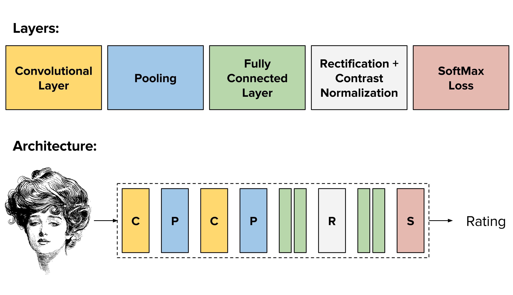

# Facial Beauty Detection using Convolutional Neural Network 
###### A system for learning the concept of female facial beauty and producing human-like predictors without using manually engineered landmark features.

#### Summary
Project done as part of the course "Introduction to Computer Vision" [CSE 527]. This is an implementation of the following research paper:
[Predicting facial beauty without landmarks](http://www.dbs.ifi.lmu.de/~yu_k/dgray_eccv2010final.pdf)
 
_\- Douglas Gray, Kai Yu, Wei Xu, and Yihong Gong._

- The Code folder contains the Caffe configuration files that we have used to set up and run the CNN.
- The python files were used to get the data ready and the input files needed for Caffe(train.txt and test.txt).
 
#### Team Members:
- Chetan Naik
- Aaswad Satpute